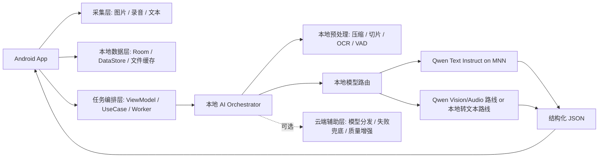

# Android 创意 AI 技术方案

## 1. 核心原则

技术路线改为：

`端侧 Qwen 本地部署为主，云端只做增强、分发和兜底。`

这意味着我们不是做一个“手机壳子 + 云上大模型”的产品，而是做一个真正面向移动端的本地 AI 应用。

首版必须优先保证下面四件事：

- 核心纪要能力在手机本地可运行
- 用户原始数据默认不出端
- 无网或弱网下仍可完成核心流程
- 云端是可选增强层，而不是基础依赖

## 2. 为什么这条路线成立

从官方材料看，`MNN` 已经把本地 LLM 和多模态 Android App 作为明确方向：MNN 主仓库把本地部署 LLM 作为核心使命之一，并发布了完整的 Android 多模态应用；其 Android README 也明确写了多模态支持、`Qwen` 兼容和“entirely on-device”的隐私导向。与此同时，官方示例也提醒，大模型在 Android 上对设备性能要求很高，低配机可能会慢、崩或无法运行。

所以正确策略不是“盲目纯端侧”，而是：

- 产品定位上坚持本地优先
- 工程实现上做设备分层
- 云端只承担辅助职责

## 3. 总体架构



这里最关键的是 `本地 AI Orchestrator`。它不是简单调一个接口，而是负责：

- 判断设备能力
- 决定走哪条本地模型链路
- 控制输入裁剪与上下文长度
- 在失败时决定是否启用云端辅助

## 4. 本地优先的能力分层

建议把能力拆成三层。

### 第一层：必须本地

- 图片采集与压缩
- 录音与音频分片
- 文本草稿保存
- 纪要任务状态管理
- 基础结构化生成
- 纪要查看与二次编辑

### 第二层：优先本地

- OCR / 图像文本抽取
- 音频转文本
- 多模态融合
- 结构化纪要生成
- 继续创作中的短文本改写

### 第三层：云端可选辅助

- 失败兜底
- 超长内容二次精修
- 高质量重写或风格化输出
- 模型市场、版本信息、远程配置

这个分层的好处是：即使云端完全不可用，产品也不是瘫痪，而是退化成“本地可用、质量略降”。

## 5. 两条本地推理路线

为了兼顾落地性和比赛展示，建议一开始就设计双路线，而不是只押一条。

### 路线 A：高配机多模态本地链路

适合旗舰 Android 机型。

- 图片直接送入本地视觉模型
- 音频直接送入本地音频模型或本地音频理解链
- 文本补充与前两者一起进入本地 `Qwen`
- 直接生成结构化纪要 JSON

价值：

- 展示效果最强
- 最符合“AI 真正在手机上跑”的赛事导向

挑战：

- 内存占用高
- 模型包大
- 对温度、耗电、时延更敏感

### 路线 B：兼容机文本中枢链路

适合更广泛设备，也是更稳的 MVP 主线。

- 图片先本地 OCR / 图像摘要
- 音频先本地 ASR / 切片转写
- 把图像摘要、音频转写、用户文本统一喂给本地 `Qwen` 文本模型
- 输出结构化纪要 JSON

价值：

- 更容易稳定落地
- 模型压力更可控
- 更适合先做出一个稳定可演示版本

我的建议是：

- `路线 B` 作为 MVP 默认路径
- `路线 A` 作为高端机展示亮点

## 6. 设备分层策略

本地部署如果不做设备分层，很容易在 Android 上陷入体验失控。建议启动阶段就按设备档位设计：

### S 档设备

推断标准：

- 旗舰芯片
- 12GB 及以上内存
- 较大可用存储

建议能力：

- 尝试本地多模态模型
- 支持更长输入
- 开启更强生成参数

### A 档设备

推断标准：

- 中高端芯片
- 8GB 到 12GB 内存

建议能力：

- 本地文本 `Qwen` 为主
- 图片和音频先做本地预处理再汇总
- 控制上下文长度和附件数量

### B 档设备

推断标准：

- 6GB 到 8GB 内存或更低

建议能力：

- 更小模型
- 更短录音时长
- 更严格的输入裁剪
- 必要时允许用户手动启用云端增强

这里“档位”是工程策略，不是营销文案。产品层面仍然应该表现为同一个功能，只是质量和速度不同。

## 7. 模型方案建议

### 文本纪要主模型

建议本地主模型优先选小尺寸 `Qwen` 指令模型，并通过 `MNN` 运行。具体到型号选择，应以你后续目标测试机的内存、首 token 延迟和持续解码速度为准。

我的判断是：

- MVP 不适合直接押大参数量模型
- 更适合先把“小模型 + 强结构化 Prompt + 严格 Schema”打磨好

### 图像能力

有两个实现方向：

- 高配机：本地视觉语言模型
- 兼容机：本地 OCR + 轻量图像摘要，再交给本地文本 `Qwen`

### 音频能力

也建议双策略：

- 高配机：本地音频理解模型
- 默认路线：本地 ASR / 分段转写后，再交给本地文本 `Qwen`

这里我刻意把“本地纪要生成”作为中心，而不是要求所有模态都必须用一个超重模型一次搞定。对 Android 落地来说，这样更稳。

## 8. Android 端技术栈

建议首版采用：

- `Kotlin`
- `Jetpack Compose`
- `ViewModel + Repository + UseCase`
- `Room`
- `DataStore`
- `WorkManager`
- `Hilt`
- `CameraX`
- `Media3` 或原生录音能力
- `Kotlinx Serialization`
- `OkHttp + Retrofit`
- `JNI + MNN Native Runtime`

### 为什么这样选

- Android 官方当前明确是 `Compose-first`，适合新项目快速构建原生界面。
- 官方推荐架构强调关注点分离、单一数据源和 UDF，这对“长任务 + 本地模型状态 + 历史缓存”的应用尤其重要。
- `WorkManager` 适合长时处理、失败重试和后台继续执行。
- `JNI + MNN` 是本地模型真正落地的关键桥梁，不能只停留在上层 Kotlin。

## 9. 推荐工程结构

建议至少拆成这些模块：

- `app`
- `core:model`
- `core:database`
- `core:filesystem`
- `core:network`
- `feature:home`
- `feature:capture`
- `feature:result`
- `feature:history`
- `ai:orchestrator`
- `ai:mnn`
- `ai:modelmanager`

### 模块职责

`ai:mnn`

- JNI 桥接
- 模型加载
- 推理会话管理
- 推理参数配置

`ai:modelmanager`

- 本地模型目录管理
- 校验模型文件完整性
- 下载 / 删除 / 更新
- 设备可用空间检查

`ai:orchestrator`

- 根据输入类型组装上下文
- 决定走本地多模态还是本地文本中枢
- 控制失败重试和云端兜底

## 10. 本地模型管理设计

这部分非常重要，因为移动端项目真正的麻烦往往不是“推理能不能跑”，而是“模型如何交付和切换”。

建议：

- APK 不直接内置大模型权重
- 首次启动后按需下载模型
- 支持显示模型大小、下载进度、校验状态
- 支持模型版本切换
- 支持删除模型释放空间

需要有独立的 `ModelManifest`：

- `modelId`
- `modelType`
- `minRamGb`
- `minStorageGb`
- `downloadUrl`
- `sha256`
- `tokenizerVersion`
- `promptTemplateVersion`
- `recommendedMaxInput`

## 11. 数据模型建议

### MemoTask

- `id`
- `title`
- `type`
- `status`
- `createdAt`
- `updatedAt`
- `templateId`
- `summary`
- `processingMode` (`local_only`, `local_preferred`, `cloud_assisted`)

### Attachment

- `id`
- `taskId`
- `kind` (`image`, `audio`, `text`)
- `localUri`
- `durationMs`
- `mimeType`
- `sortOrder`
- `preprocessText`

### StructuredMemo

- `taskId`
- `oneLineSummary`
- `background`
- `topics`
- `facts`
- `decisions`
- `actionItems`
- `risks`
- `quotes`
- `tags`
- `rawJson`
- `sourceTrace`

### DeviceProfile

- `id`
- `ramClass`
- `abi`
- `socHint`
- `supportsNnapi`
- `supportsGpuPath`
- `recommendedModelId`

## 12. 结构化输出 Schema

本地模型更需要稳定结构，所以首版必须强制 JSON 输出，再由客户端渲染。

```json
{
  "title": "头脑风暴纪要 - 夏季活动方案",
  "memo_type": "brainstorm",
  "one_line_summary": "围绕夏季活动主题、预算和执行分工完成初步讨论。",
  "background": "团队在办公室进行 35 分钟讨论，包含白板草图和口头补充。",
  "topics": [
    {
      "name": "活动主题",
      "summary": "倾向选择轻量互动型线下活动。"
    }
  ],
  "facts": [
    "预算上限暂定 8 万元",
    "活动时间优先考虑 7 月下旬"
  ],
  "decisions": [
    "先出两版活动策划案再评审"
  ],
  "action_items": [
    {
      "task": "输出方案 A/B 两个版本",
      "owner": "待确认",
      "deadline": "本周五"
    }
  ],
  "risks": [
    "场地资源尚未确认",
    "预算明细仍需审批"
  ],
  "quotes": [
    "不要把活动做成纯展示，最好让用户能参与。"
  ],
  "tags": [
    "活动策划",
    "头脑风暴"
  ]
}
```

并且要加一层本地校验：

- JSON 是否可解析
- 必填字段是否存在
- 数组长度是否超限
- 失败时是否能二次修复

## 13. 本地 AI 处理链路

建议生成过程拆成下面几步：

1. 输入整理
   统一图片、音频、文本元数据，写入本地任务。
2. 设备判断
   根据设备档位决定模型路线和输入上限。
3. 本地预处理
   图片压缩、OCR、音频切片、VAD、转写或摘要。
4. 本地融合
   将预处理结果拼成适合本地 `Qwen` 的上下文。
5. 本地结构化生成
   让模型输出固定 JSON。
6. 本地结果修复
   对 JSON、字段和展示结构做校验与补救。
7. 可选云端增强
   只有用户允许或本地失败时才启用。

## 14. 云端辅助应该做什么

云端不应该承接主链路，而应只做下面几类事：

- 模型清单与下载地址下发
- Prompt / Schema 远程配置
- 本地失败后的兜底生成
- 高质量重写或导出增强
- 统计匿名性能数据

不建议把以下能力做成云端强依赖：

- 核心纪要生成
- 输入文件的默认上传
- 历史纪要的唯一存储

## 15. 本地优先带来的关键风险

### 风险 1：模型包太大

应对：

- 模型按需下载
- 首版只支持 1 到 2 个核心模型
- 首次引导明确展示存储占用

### 风险 2：高温降频

应对：

- 控制单次输入上限
- 长任务分段处理
- 推理中展示节流与暂停能力

### 风险 3：低配机跑不动

应对：

- 启动时做设备分档
- 默认给出推荐模型
- 提供“本地增强 / 云端辅助”开关

### 风险 4：本地多模态链路复杂

应对：

- 先做文本中枢路线
- 再给高配机补多模态直达路线

## 16. SME2 的位置

`SME2` 仍然值得保留，但它现在应该明确放在第三层：

- 不是 MVP 前提
- 不是首个里程碑阻塞项
- 是后续“旗舰机专项提速”工作

也就是说，先证明“Qwen 在 Android 本地能稳定产生有用纪要”，再做 `SME2` 优化，顺序更健康。

## 17. 里程碑建议

### 里程碑 1：本地文本纪要跑通

- 完成 Android 工程骨架
- 接入 `MNN`
- 跑通本地 `Qwen` 文本模型
- 用本地文本上下文生成结构化纪要

### 里程碑 2：本地多模态输入跑通

- 图片 OCR / 摘要接入
- 音频切片 / 转写接入
- 多输入融合到本地纪要流程

### 里程碑 3：高配机多模态强化

- 尝试更强本地视觉/音频链路
- 对旗舰设备做展示优化

### 里程碑 4：专项优化

- 量化
- 热启动优化
- KV Cache 优化
- 长输入切分
- 可选 `SME2` 加速

## 18. 当前推荐结论

如果你现在就要开始工程实施，我建议默认口径是：

- 产品主线：`多模态纪要`
- 技术主线：`Qwen 本地部署 + MNN 推理`
- 工程主线：`设备分层 + 本地优先 + 云端兜底`
- 比赛主线：`先证明手机本地真的能跑，再谈性能冲刺`

## 19. 参考资料

- Android App Architecture: https://developer.android.com/topic/architecture
- Android Compose-first: https://developer.android.com/develop/ui/compose/first
- MNN 官方仓库: https://github.com/alibaba/MNN
- MNN Chat Android App README: https://github.com/alibaba/MNN/blob/master/apps/Android/MnnLlmChat/README.md
- Qwen 官方仓库: https://github.com/QwenLM/Qwen
