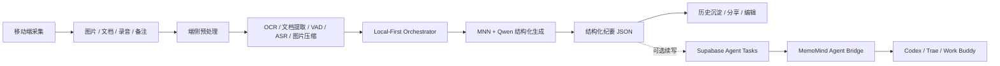

# MemoMind 创意方案

> 基于 2026-06-21 替换后的 MemoMind 项目源码整理

## 1. 项目一句话定位

MemoMind 不是一个“手机里的通用聊天助手”，而是一款面向移动场景的 `多模态创意纪要与任务续写工具`：用户把图片、录音、文档、碎片文字交给手机端 AI，系统先生成结构化纪要，再继续把纪要转成待办、提纲、图表建议或协作文案。

## 2. 应用场景

### 场景一：会议与头脑风暴整理

- 拍白板、拍草图、导入会议录音
- 追加几条临时备注
- 自动生成主题、结论、行动项、风险点

### 场景二：内容创作与采访采风

- 导入采访录音、现场照片、采访提纲
- 自动提炼关键信息、原话、后续选题方向
- 一键继续生成脚本提纲、选题卡片、邮件草稿

### 场景三：课程学习与调研沉淀

- 导入 PPT、PDF、课堂录音、个人笔记
- 自动生成知识点脉络、重点事实、待复习问题
- 沉淀成可检索、可复用的学习纪要

### 场景四：移动办公中的“拍完即整理”

- 在地铁、展会、客户现场快速拍照和录音
- 不依赖 PC，不要求稳定网络
- 回到结果页就能拿到结构化内容和后续动作建议

## 3. 用户痛点

1. 信息来源碎片化  
   语音、图片、文档、手写笔记分散在多个 App 里，后续整理成本很高。

2. 传统会议纪要工具偏单模态  
   只能转写录音，无法把白板照片、PDF、PPT、备注统一理解。

3. 手机端采集强、整理弱  
   用户最常发生记录行为的地方在手机端，但真正的整理和二次创作往往要回到电脑上完成。

4. 云端方案有隐私与网络门槛  
   会议、采访、学习材料常常不适合上传，弱网环境下也容易中断。

5. 纪要产物不可继续使用  
   很多工具只能给一段总结，不能直接转成任务拆解、图表建议、汇报素材或对外沟通文案。

## 4. 当前项目已体现的能力基础

从替换后的源码看，MemoMind 已经具备较完整的产品闭环雏形：

- `图片输入`：支持图片 OCR、图片语义补充、裁剪处理
- `音频输入`：支持录音与音频文件端侧转写
- `文档输入`：支持 `PDF / DOCX / PPTX / TXT` 读取，其中 PDF 和内嵌图片可走 OCR
- `本地纪要生成`：通过本地结构化 Prompt 输出 JSON 纪要
- `历史沉淀`：任务、纪要、资产引用都已本地持久化
- `远程续写`：支持通过 Supabase + MemoMind Agent Bridge 将纪要继续派发给 `Codex / Trae / Work Buddy`

这意味着它已经不是单点 Demo，而是一个“端侧采集 -> 端侧理解 -> 结构化沉淀 -> 外部 Agent 协作”的可扩展原型。

## 5. 产品方案

### 5.1 核心价值主张

`先在手机上把复杂内容整理清楚，再把整理好的结果继续变成可执行成果。`

相比普通会议纪要产品，MemoMind 更强调两件事：

- 入口是多模态采集，而不是单一录音转写
- 输出不是结束，而是后续创作和协作的中间资产

### 5.2 建议主打功能

1. 新建 Memo 任务  
   支持图片、文档、录音、备注混合输入。

2. 一键结构化纪要  
   输出摘要、背景、主题、事实、决策、行动项、风险、标签。

3. 继续创作  
   基于纪要继续生成：
   - 项目待办
   - 汇报提纲
   - 图表/表格建议
   - 对外同步文案
   - 邮件草稿

4. 历史回看与复用  
   所有纪要都可以回查、编辑、分享、二次派发。

## 6. 技术方案

## 6.1 总体架构

## 6.2 模型选型

以下内容分为“当前源码已经体现”与“建议补强”两部分。

### 当前源码已体现的模型与能力

- `结构化纪要主模型`：`Qwen3-VL-2B` 路线，通过 `MNN` 在 Android 端侧运行
- `语音识别`：`Sherpa-ONNX SenseVoice` + `Silero VAD`
- `图片 OCR`：`ML Kit Chinese Text Recognition`
- `文档理解`：`PdfRenderer + OCR`、`OOXML 文本提取 + 内嵌图片 OCR`

### 建议补强的模型分层

这是基于现有架构给出的建议，不是当前代码里已经完全落地的部分：

#### S 档设备（12GB+ RAM，旗舰机）

- 主模型：`Qwen3-VL-2B` 多模态版本
- 用途：图文混合理解、复杂纪要生成、演示型场景

#### A 档设备（8GB 左右 RAM）

- 建议增加：`Qwen3 1.7B / 1.8B` 级文本指令模型
- 用途：将图片和音频先转成文本，再走文本纪要生成

#### B 档设备（6GB 及以下）

- 建议增加：更轻量文本模型，或仅保留本地预处理 + 受控云端增强
- 用途：保证“能用”和“不会崩”，而不是追求最强效果

### 选型原因

1. 当前项目最强竞争力是 `多模态采集 + 结构化纪要`，因此需要至少保留一条可展示的 VL 路线。
2. Android 真机差异巨大，必须为更广设备准备 `文本中枢` 路线。
3. 语音、图片、文档并不一定都要由一个超重模型一次吃完，先预处理再汇总给 LLM，落地更稳。

## 6.3 推理框架

### 端侧推理主框架：MNN

当前项目已经按 `MNN + JNI Bridge + Android CMake` 组织好了原生推理层，优势在于：

- 适合 Android 端侧部署
- 已为 `Qwen / 多模态 / LLM Session` 预留清晰接口
- 方便接入真实 `MNN-LLM` 运行时
- 便于继续做 `CPU / NPU / NNAPI` 路由

### 语音推理框架：Sherpa-ONNX

- 负责离线音频转写
- 结合 `Silero VAD` 做分段识别
- 适合长音频按块处理，减小内存峰值

### 图片与文档理解框架

- `ML Kit OCR`：负责中文 OCR
- `PdfRenderer`：负责 PDF 页渲染
- `ZipInputStream + OOXML 解析`：负责 `docx / pptx` 正文抽取

这条链路的优点是：在不完全依赖超大视觉模型的前提下，也能把“纸面内容”压缩成高价值文本上下文。

## 6.4 端侧适配思路

### 1. Local-First 编排

项目已经体现出 `LocalFirstMemoOrchestrator` 思路：优先本地完成，多模态能力不足时退化到“文本中枢”路径，再不行才走云端辅助。

### 2. 按需加载，避免常驻

当前架构很适合继续坚持以下策略：

- OCR 只在图片/文档处理时拉起
- `ASR + VAD` 只在录音或音频处理时拉起
- `MNN Session` 仅在生成纪要时打开
- 任务完成后及时释放 runtime 和会话

### 3. 长内容分块处理

项目中的 `StructuredMemoTaskExecutor` 已体现：

- 长文本切块
- 分块摘要
- 滚动合并
- 最终统一生成结构化纪要

这对 20 到 60 分钟的会议、课程、访谈尤其关键。

### 4. 输入预算控制

建议继续强化以下端侧规则：

- PDF 只先读取前若干页
- Office 文档内嵌图片只 OCR 前若干张
- 图片先压缩、裁剪、增强，再走 OCR 或视觉模型
- LLM Prompt 维持严格字符预算和字段 Schema

### 5. 包体与模型解耦

当前工程已经支持通过构建参数控制是否把大模型和 ASR 模型打进 APK。这个思路非常对，建议延续为：

- 默认分发轻量包
- 大模型改为按需下载 / 本地导入
- 让“可安装、可演示、可稳定运行”优先于“所有能力一次性塞进 APK”

### 6. CPU / SME2 / KleidiAI 优化

从当前 MNN build profile 看，项目已经朝 `SME2 + KleidiAI` 打开了优化开关。后续建议重点放在：

- 利用框架已有优化能力
- 做不同机型的线程数与 backend 策略
- 控制高负载场景下的功耗、发热和首 token 时延

## 7. 创新点

### 创新点一：多模态纪要不是终点，而是创作入口

多数产品停在“总结一下”。MemoMind 的方向是把纪要变成后续工作的中间资产，天然适合继续生成待办、提纲、图表和汇报内容。

### 创新点二：手机端完成“采集到结构化”的主闭环

不是把手机当上传入口，而是让手机本身具备理解和整理能力，弱网或离线也有基础可用性。

### 创新点三：文档、图片、录音统一进入同一条认知链路

当前项目已经支持 `图片 OCR + 文档抽取 + 音频转写 + 文本补充` 汇总成统一输入，这比单独做一个录音转写工具更有场景穿透力。

### 创新点四：本地纪要 + 桌面 Agent 续写的双阶段协同

MemoMind 的一个很有意思的方向，是先由手机端完成结构化沉淀，再通过 `MemoMind Agent Bridge` 把纪要派发给 `Codex / Trae / Work Buddy` 做更重的后处理。这让移动端和桌面端形成分工，而不是彼此替代。

### 创新点五：把工程优化直接转化为产品竞争力

分段 ASR、Prompt 预算、按需加载、模型包解耦、设备分层，这些不只是技术优化，也直接决定产品能否真正落地。

## 8. 预期效果

以下是建议作为汇报或比赛验收的目标效果：

### 用户体验效果

- 用户可以在 1 分钟内完成一次多模态素材录入
- 用户可以在手机端直接拿到结构化纪要，不必回到电脑再手工整理
- 用户能明显感受到“拍完就能整理、录完就能沉淀”

### 业务价值效果

- 降低会议、采访、学习整理成本
- 提高碎片信息转成结构化内容的效率
- 提高纪要的复用率，而不是只生成一次就废弃

### 技术展示效果

- 展示真实端侧 AI 路线，而非纯云端壳应用
- 能清楚展示 `Qwen + MNN + Android` 的端侧部署价值
- 能体现移动端性能优化、模型路由和任务分层能力

### 建议量化指标

- 结构化纪要首轮生成成功率 `>= 85%`
- 10 分钟录音处理成功率 `>= 90%`
- 关键字段完整率（摘要、主题、行动项）`>= 80%`
- 至少 70% 的体验用户认为“比手工整理更省时间”

## 9. 建议演进路线

### 第一阶段：把比赛展示链路打透

- 固化 `图片/文档/录音 -> 结构化纪要` 闭环
- 稳定 `Qwen + MNN` 本地生成演示
- 补足结果页的“继续创作”路径

### 第二阶段：做设备分层与模型分级

- 增加轻量文本模型
- 根据设备档位自动选择推理路径
- 优化时延、内存峰值与包体

### 第三阶段：把纪要变成协作入口

- 打通更多 Agent 或企业协作工具
- 增加导出、分享、任务同步
- 从“创意整理工具”进一步演进为“移动端工作入口”

## 10. 结论

如果只把 MemoMind 看成“Android 上的纪要 App”，它会显得普通；但如果把它定义为：

`一款以端侧 AI 为核心、把多模态素材直接转成结构化成果，并能继续派发给外部 Agent 的移动创意工作台`

这个方向就很有辨识度。

它同时踩中了三个很强的价值点：

- `场景真实`：会议、学习、采访、创作都成立
- `技术可讲`：Qwen、MNN、Sherpa-ONNX、端侧优化、Agent Bridge 都有展示空间
- `产品可长大`：从纪要生成，顺理成章扩展到任务协作和持续创作
